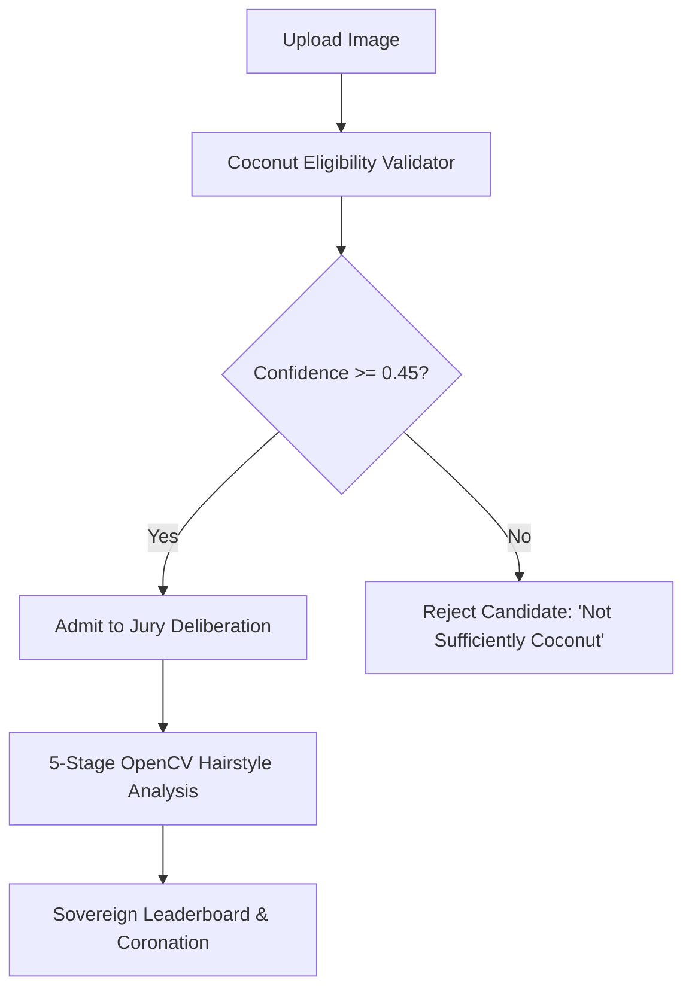

# THENGA ROYALE 👑
### *The Sovereign Arboreal Hairstyle Pageant — MR. തെങ്ങ് 2026*

<div align="center">

```
  🌴👑🌴   THENGA ROYALE 2026   🌴👑🌴
  "തെങ്ങിനും ഇത്തിരി സ്റ്റൈലൊക്കെ ആകാം"
```

**The world's premier arboreal beauty pageant dedicated to scientifically answering:**  
*“Which coconut tree has the most magnificent hairstyle?”*  
*Evaluated with deterministic Computer Vision, OpenCV feature extraction, and unapologetic pageant drama.*

<br/>

[](https://thenga-royale.vercel.app)
[](https://github.com/liyajosepeter/thenga-royale)

<br/>

[](https://nextjs.org/)
[](https://react.dev/)
[](https://www.typescriptlang.org/)
[](https://tailwindcss.com/)
[](https://www.python.org/)
[](https://opencv.org/)
[](https://supabase.com/)
[](https://thenga-royale.vercel.app)

</div>

---

## 🔗 Live Application & Deployment

| Resource | Direct Link |
| :--- | :--- |
| **🌐 Production Web App (Vercel)** | [https://thenga-royale.vercel.app](https://thenga-royale.vercel.app) |
| **📦 Source Code Repository** | [https://github.com/liyajosepeter/thenga-royale](https://github.com/liyajosepeter/thenga-royale) |
| **⚡ API Health Endpoint** | [https://thenga-royale.vercel.app/api/health](https://thenga-royale.vercel.app/api/health) |

---

## 🌟 Table of Contents
1. [Overview & Philosophy](#-overview--philosophy)
2. [Pageant Chambers (Core Pages)](#-pageant-chambers)
3. [The 4 Hairstyle Dimensions & Math](#-the-4-hairstyle-dimensions--scoring-formula)
4. [🌴 Coconut Eligibility Pre-Validation](#-coconut-eligibility-pre-validation)
5. [👑 Sovereign Pageant Titles & Awards](#-sovereign-pageant-titles--awards)
6. [🛠️ Architecture & Technology Stack](#️-architecture--technology-stack)
7. [📁 Directory Structure](#-directory-structure)
8. [🚀 Getting Started Locally](#-getting-started-locally)
9. [☁️ Vercel Deployment Guide](#️-vercel-deployment-guide)
10. [📜 Pageant Protocol Rules](#-pageant-protocol-rules)

---

## 🌴 Overview & Philosophy

**Thenga Royale** is a unique intersection of serious computer vision research, high-fashion beauty pageant aesthetics (*"Miss Universe × Luxury Tropical Resort × Coconut Kingdom"*), and sarcastic Malayali arboreal commentary.

### 🌿 Core Pageant Principles:
- **No Logins or Paywalls**: Anonymous, friction-free submission flight for 1, 5, 10, or 20 coconut trees at once.
- **Independent Contestant Trees**: Every uploaded photo competes as its own sovereign candidate.
- **100% Deterministic Mathematical Scoring**: The exact same coconut photo will always receive the exact same score across all four dimensions.
- **Zero-Config Persistent Storage**: Automatic synchronization across Supabase PostgreSQL and browser local persistence fallback.
- **Interactive Coronation Ceremony**: Real-time golden envelope unsealing, tiara crowning animations, frond rustling speech generator, and cheer counters.

---

## 🏛️ Pageant Chambers

### 1. 🌺 The Grand Hall (`/`)
- Sovereign Arboreal Pageant hero showcase with custom Malayalam typography (**`MR. തെങ്ങ് 2026`** and **`✦ തെങ്ങിനും ഇത്തിരി സ്റ്റൈലൊക്കെ ആകാം ✦`**).
- The 4 Judging Criteria cards, 5-step pageant sequence, and Top Titleholders Hall of Fame.

### 2. 🔬 Jury Deliberation Chamber (`/judge`)
- Multi-image drag-and-drop registration dropzone with auto-assigned sarcastic monikers (*Lord Frondington III*, *Baron von Coconut*, *The Kovalam Drama Queen*).
- **Real-Time Coconut Eligibility Pre-Validation**: Instant detection of palm foliage and crown structure before admitting images into scoring.
- **5-Stage Computer Vision Scanning Flow**: `FOLIAGE DETECTION` &rarr; `CANOPY ANALYSIS` &rarr; `SYMMETRY ANALYSIS` &rarr; `WIND STYLE ANALYSIS` &rarr; `FINAL SCORE`.

### 3. 👑 Coronation Gala (`/awards`)
- **Phase 1: Jury Conclave Adjudication**: Live ticker cycling through dry mathematical findings.
- **Phase 2: High Commission Golden Envelope**: Interactive wax-sealed envelope that bursts with golden confetti when unsealed.
- **Phase 3: The Grand Coronation Reveal**:
  - Animated royal crown tiara descending onto the winning monarch tree.
  - **Dynamic Frond Rustling Speech Generator**: Generates humorous acceptance speeches translated from frond rustling.
  - **Royal Standing Ovation**: Interactive cheer and applause generator with live standing ovation counter.
  - **Multi-Perspective Jury Deliberations**: Toggleable commentary from the *High-Society Pageant Critic*, *OpenCV Mathematical Kernel*, and *Bitter 2nd-Place Palm*.

### 4. 🏆 The Royal Rankings (`/leaderboard`)
- **3-Tier Grand Podium**: Sovereign gold pedestal for 1st place, elevated glass pedestals for 2nd and 3rd place.
- **Category King Filters**: `ALL`, `MR. COCONUT`, `VOLUME KING`, `SPREAD KING`, `SYMMETRY KING`, `WIND KING`.
- Live contestant search with instant metric cards and official title badges.

### 5. 📜 Official Judging Dossier (`/results?id=...`)
- Comprehensive beauty pageant judging card with 4-dimension breakdown, canopy bounding coordinates, and certified jury critique.
- **High-Resolution Certificate Generator (PNG 1200 × 850 px)** with one-click download and print-ready dossier formatting.

---

## 📐 The 4 Hairstyle Dimensions & Scoring Formula

All scores are calculated through calibrated color-space segmentation, convex hull extraction, and spatial moments:

| Dimension | Pageant Weight | CV Methodology | What It Measures |
| :--- | :---: | :--- | :--- |
| **🌿 Hair Volume** | **30%** | Foliage pixel density / Canopy convex hull envelope | *Chloroplast canopy fullness and frond density* |
| **↔️ Hair Spread** | **25%** | Horizontal wingspan aspect ratio ($W / H$) | *Broad horizontal frond reach and runway drama* |
| **⚖️ Symmetry** | **25%** | Bilateral centroid equilibrium: $1.0 - \frac{\|L - R\|}{L + R}$ | *Bilateral balance across the vertical trunk axis* |
| **💨 Wind Style** | **20%** | Sobel directional gradient angular dispersion | *Aerodynamic drama and monsoonal hairtoss intensity* |

$$\text{Composite Score} = (V \times 0.30) + (S_{\text{spread}} \times 0.25) + (S_{\text{sym}} \times 0.25) + (W \times 0.20)$$

---

## 🌴 Coconut Eligibility Pre-Validation

Before any candidate palm proceeds to hairstyle analysis, it passes through an automated computer vision eligibility filter (`python/coconut_validator.py` / `/api/validate`):



### Detection Metrics:
1. **Foliage Color Segmentation**: HSV isolation of lush tropical green fronds ($H \in [25, 88]$) and sunlit fronds while explicitly filtering human skin tones ($YCrCb$).
2. **Pinnate Leaflet Edge Density**: Canny edge detection within foliage to detect intricate leaflet frequency vs. smooth artificial objects.
3. **Canopy Geometry & Contour Branching**: Perimeter-to-area fractal complexity and horizontal canopy spread.
4. **Confidence Score ($0.00 - 1.00$)**: Real non-faked confidence rating with a calibrated threshold of `0.45`.

---

## 👑 Sovereign Pageant Titles & Awards

- 👑 **MR. തെങ്ങ് 2026** — Awarded to the supreme contestant with the highest composite hairstyle score.
- 🌿 **VOLUME KING** — Awarded for maximum chloroplast canopy density.
- ↔️ **SPREAD KING** — Awarded for the most extravagant horizontal frond wingspan.
- ⚖️ **SYMMETRY KING** — Awarded for flawless bilateral balance across the central trunk axis.
- 💨 **WIND KING** — Awarded for highest monsoonal wind-tossed drama and angular dispersion.

---

## 🛠️ Architecture & Technology Stack

### 🖥️ Frontend & UI Framework
- **Framework**: [Next.js 14.2.15](https://nextjs.org/) (App Router, React 18, TypeScript 5.6)
- **Styling**: [Tailwind CSS 3.4](https://tailwindcss.com/) with custom **Dark Green Glassmorphism** design system (`#04100B`, `#0A261D`, `#134434`, `#38B289`, `#D4AF37`)
- **Typography**: Google Fonts (*Playfair Display, Plus Jakarta Sans, Gayathri, Anek Malayalam, JetBrains Mono*)
- **Animations & Effects**: `canvas-confetti`, `lucide-react`, custom CSS glass keyframes

### 🐍 Computer Vision & Mathematical Engine
- **Language & Runtime**: Python 3.13 / Serverless API Functions
- **Libraries**: `opencv-python-headless>=4.8.0`, `numpy>=1.26.0`
- **Fallback Engine**: Pure JavaScript spatial mathematical analysis engine for environments without Python binaries.

### 💾 Database & Cloud Infrastructure
- **Database**: [Supabase](https://supabase.com/) PostgreSQL database with client-side local persistence sync.
- **Storage**: Supabase Object Storage (`contestants` bucket) for contestant photography.
- **Deployment Platform**: **Vercel** ([https://thenga-royale.vercel.app](https://thenga-royale.vercel.app)) with Next.js edge routing and serverless function handlers.

---

## 📁 Directory Structure

```
thenga-royale/
├── app/
│   ├── page.tsx                  # Grand Hall (Home & Arboreal Pageant showcase)
│   ├── judge/page.tsx            # Jury Deliberation Chamber (Registration & Scanning)
│   ├── awards/page.tsx           # Coronation Ceremony Gala (Unsealing & Speeches)
│   ├── leaderboard/page.tsx      # The Royal Rankings (Podium & Category Kings)
│   ├── results/page.tsx          # Official Judging Dossier (Certificate PNG Generator)
│   ├── api/
│   │   ├── analyze/route.ts      # Next.js CV Analysis route (Python + Math Fallback)
│   │   ├── validate/route.ts     # Next.js Eligibility Validation API route
│   │   ├── entries/route.ts      # Supabase & Local DB persistence route
│   │   └── health/route.ts       # System health check route
│   ├── layout.tsx                # Root layout with Glassmorphism navigation
│   └── globals.css               # Pageant design tokens, glass panels & animations
├── components/
│   ├── Navbar.tsx                # Translucent dark green navigation bar
│   ├── Footer.tsx                # Pageant criteria & chambers footer
│   ├── UploadDropzone.tsx        # Multi-image uploader & 5-stage CV scanner
│   ├── CoronationCeremony.tsx    # Interactive 3-phase coronation ceremony
│   ├── AnalysisResultCard.tsx    # Detailed candidate judging breakdown
│   ├── ContestantCard.tsx        # Leaderboard candidate card
│   ├── MetricBar.tsx             # Animated dimension score bar
│   └── AwardBadge.tsx            # Royal pageant title sashes & badges
├── python/
│   ├── coconut_validator.py      # OpenCV coconut eligibility feature extractor
│   ├── image_analysis.py         # OpenCV HSV segmentation, contours, moments
│   └── scoring.py                # Weighted score formulas & sarcastic critiques
├── api/
│   ├── analyze.py                # Vercel Python serverless analysis handler
│   ├── validate.py               # Vercel Python serverless validator handler
│   └── health.py                 # System health check endpoint
├── lib/
│   ├── types.ts                  # TypeScript data contracts & pageant interfaces
│   ├── awards.ts                 # Deterministic pageant king award calculator
│   ├── mockData.ts               # Seed monarch contestants
│   └── supabase.ts               # Supabase database & storage client
├── requirements.txt              # Headless Python dependencies
├── vercel.json                   # Vercel Next.js framework configuration
├── tailwind.config.js            # Emerald & gold luxury color palette
└── package.json
```

---

## 🚀 Getting Started Locally

### Prerequisites
- Node.js `v18.17+` or `v20+`
- Python `3.10+` (optional: built-in JavaScript mathematical fallback runs if Python is omitted)

### 1. Clone & Install Dependencies
```bash
git clone https://github.com/liyajosepeter/thenga-royale.git
cd thenga-royale

# Install Node dependencies
npm install

# (Optional) Install Python computer vision dependencies
pip install -r requirements.txt
```

### 2. Environment Configuration (Optional)
Create a `.env` file in the root directory:
```env
NEXT_PUBLIC_SUPABASE_URL=https://your-project.supabase.co
NEXT_PUBLIC_SUPABASE_ANON_KEY=your-anon-key
NEXT_PUBLIC_SUPABASE_BUCKET=contestants
```
*(If Supabase credentials are not provided, the application runs in client-side persistent storage mode automatically).*

### 3. Run Development Server
```bash
npm run dev
```
Open [http://localhost:3000](http://localhost:3000) in your browser.

### 4. Run Test Suites & Verification
```bash
# Test Python Computer Vision Engine
python python/image_analysis.py --test

# Test Coconut Candidate Validator
python python/coconut_validator.py --test

# Run TypeScript type verification
npx tsc --noEmit
```

---

## ☁️ Vercel Deployment Guide

Thenga Royale is architected for **zero-config deployment on Vercel**:

1. Push your repository to GitHub: `https://github.com/liyajosepeter/thenga-royale`
2. Navigate to [Vercel Dashboard](https://vercel.com/new) and import `thenga-royale`.
3. Framework Preset: **Next.js** (automatically detected from `vercel.json`).
4. (Optional) Set environment variables:
   - `NEXT_PUBLIC_SUPABASE_URL`
   - `NEXT_PUBLIC_SUPABASE_ANON_KEY`
   - `NEXT_PUBLIC_SUPABASE_BUCKET`
5. Click **Deploy**. Your app will be live at `https://thenga-royale.vercel.app`!

---

## 📜 Pageant Protocol Rules

1. All trees compete anonymously; humans are merely humble conduits for tree photography.
2. Fronds rustled under wind speeds exceeding 40 knots shall be classified as *High-Velocity Pageant Drama*.
3. No coconuts were harmed during contour segmentation or moment calculations.
4. The decisions of the High Commission for Arboreal Splendor are final and mathematically absolute.

---

<div align="center">
  <sub>© 2026 Thenga Royale High Commission for Arboreal Splendor. All fronds reserved. 🌴👑</sub>
</div>